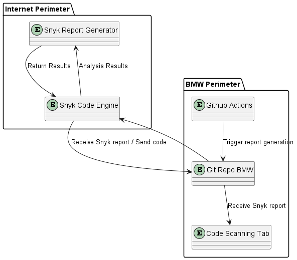
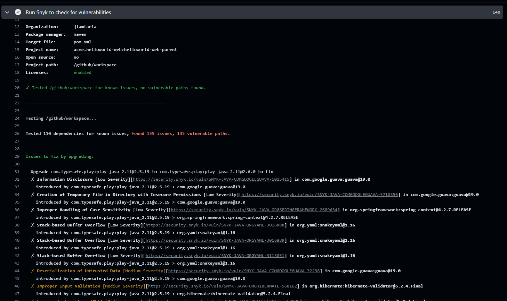
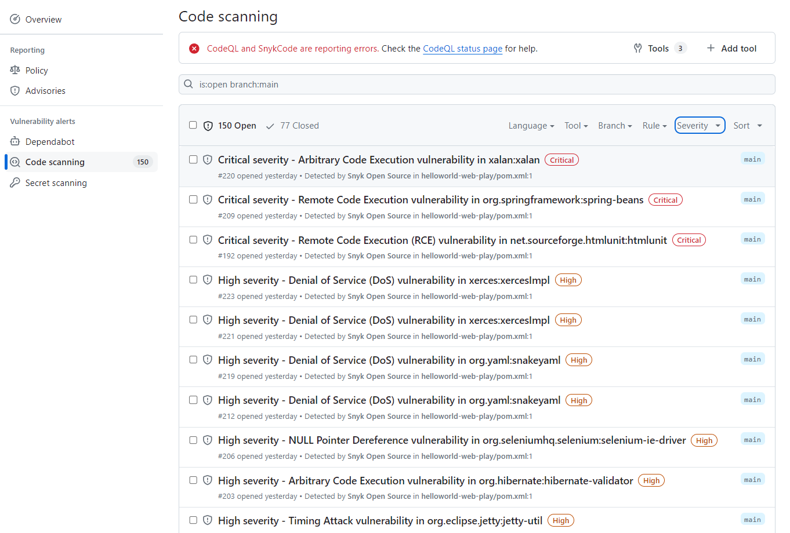
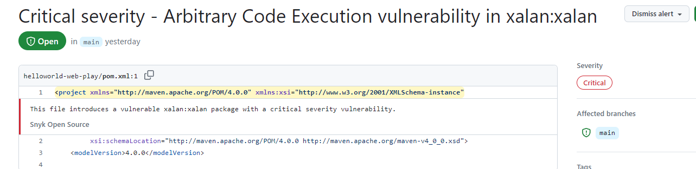
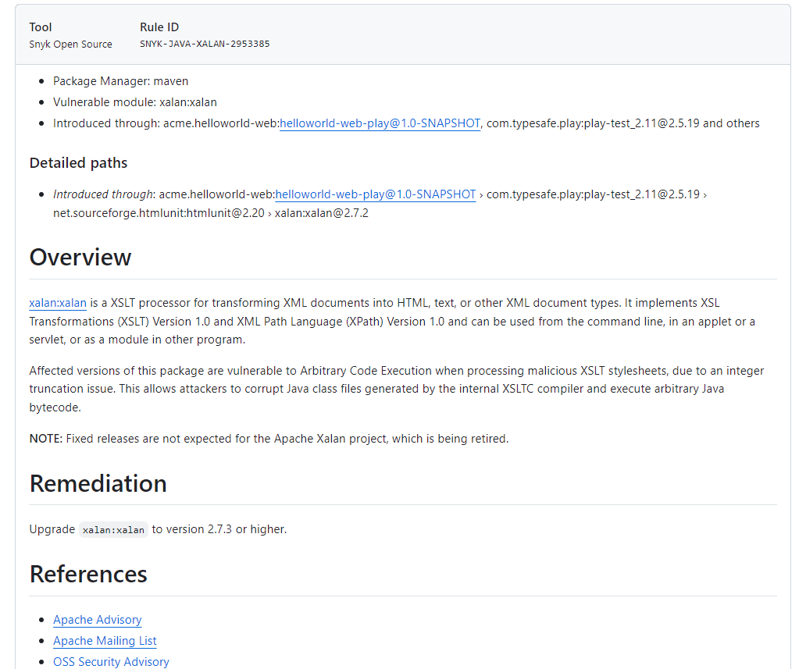
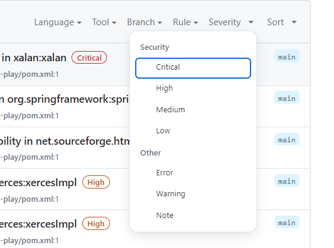
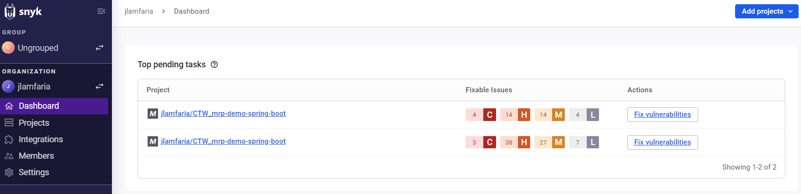
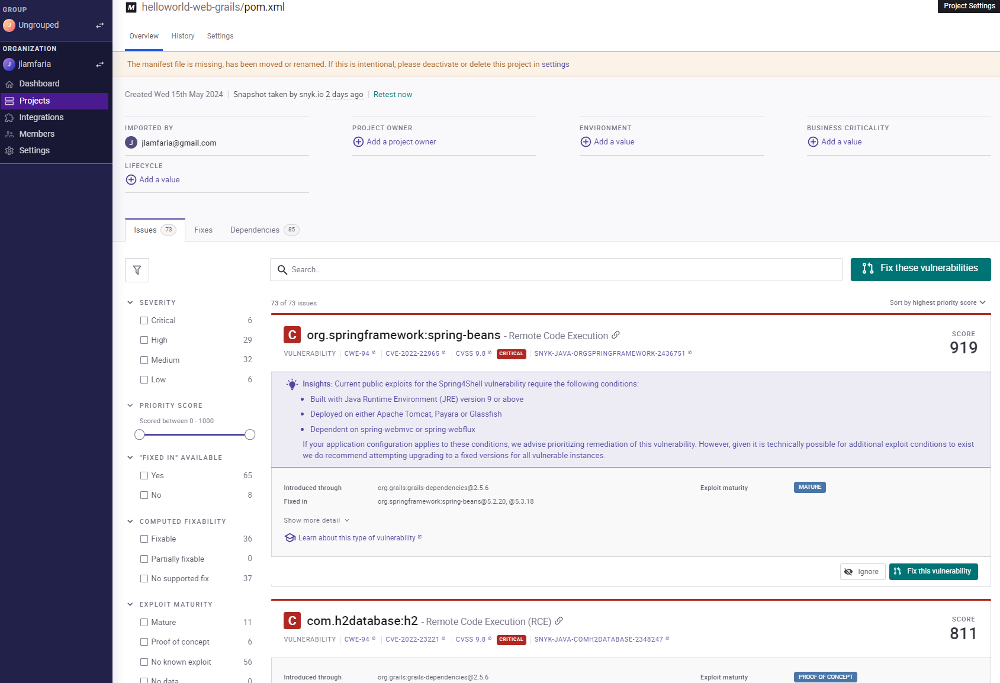
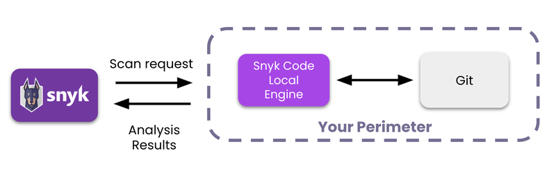

# Introduction

Snyk's Static Application Security Testing (SAST) tools analyze source code for vulnerabilities like injection flaws, XSS,
and more. Integrated into development workflows, it provides prioritized recommendations for remediation, enhancing code 
quality and security. With comprehensive reporting, teams gain visibility to track security initiatives and mitigate risks 
effectively, ensuring the delivery of secure software.

Supported languages:
- JavaScript/Node.js: Snyk offers extensive support for JavaScript and Node.js applications, including npm packages and dependencies.
- Java: Snyk provides support for scanning Java applications and libraries, including Maven and Gradle dependencies.
- Python: Snyk can analyze Python applications and dependencies, including packages managed via pip.
- Ruby: Snyk supports scanning Ruby applications and gems, ensuring the security of Ruby on Rails projects and other Ruby-based applications.
- Go: Snyk offers support for Go applications and modules, enabling developers to identify and remediate vulnerabilities in their Go codebases.
- PHP: Snyk can scan PHP applications and libraries, including Composer dependencies commonly used in PHP projects.
- .NET: Snyk provides support for .NET applications, including those built using C# and utilizing NuGet packages.
- Container Images: Snyk supports scanning container images for vulnerabilities, regardless of the programming language used within the containers.
- Infrastructure as Code (IaC): Snyk also offers support for scanning Infrastructure as Code templates written in languages such as YAML, JSON, Terraform, and CloudFormation.

## Arquiteture view

Snyk is a cloud-based platform that provides a range of security tools and services to help organizations secure their software development lifecycle.
The code, via Github Actions, is scanned by Snyk and the results are displayed in the Github Security Tab, in the Code Scanning Alerts section.

Assuming the Github repo is from a private repository, the code it's scanned by Snyk each time the code was pushed (the code is pushed to Snyk App - internet side) 
and the report returns and is displayed in the Github Security Tab.



## Implementation of a PoC (Proof of Concept)

### Github Action

As Snyk requires a public/private repository to scan the code (open to a Internet connection), the PoC was implemented in a personal Github Repository. 
Repo reference for tests to scan diferentes levels of vunerabilities: https://github.com/dbelob/helloworld-web
This repository contains multiple folders with different levels of vulnerabilities in the code, based in different versions of JAVA/Maven dependencies.

Github Action code to scan and generate the report the repository:
```yaml
name: Example workflow for Maven using Snyk
#description: 'Snyk test demo for Maven 3.9.3/JAVA 17, linked to US - https://atc.bmwgroup.net/jira/browse/CAWE-790'

on: push
jobs:
  security:
    permissions:
      contents: read # for actions/checkout to fetch code
      security-events: write # for github/codeql-action/upload-sarif to upload SARIF results
      actions: read # only required for a private repository by github/codeql-action/upload-sarif to get the Action run status
    runs-on: ubuntu-latest
    steps:
      - uses: actions/checkout@master

      - name: Install Snyk CLI
        run: npm install -g snyk && npm update -g snyk && npm i -g snyk-recursive && npm update -g snyk-recursive && npm install snyk-to-html -g && echo "Snyk CLI already installed"

      - name: Run Snyk to check for vulnerabilities
        uses: snyk/actions/maven-3-jdk-17@master
        continue-on-error: true # To make sure that SARIF upload gets called
        env:
          SNYK_TOKEN: ${{ secrets.SNYK_TOKEN }}
        with:
          args: --all-projects --sarif-file-output=snyk.sarif --command=monitor

      - name: Output original SARIF file
        run: cat snyk.sarif

      - name: Validate and fix SARIF file
        run: |
          jq '
          .runs[].tool.driver.rules |= map(
            if .properties["security-severity"] == null or .properties["security-severity"] == "undefined" then
              .properties["security-severity"] = "5.0"
            else
              .properties["security-severity"] |= tostring
            end
          )' snyk.sarif > fixed-snyk.sarif

      - name: Output fixed SARIF file
        run: cat fixed-snyk.sarif

      - name: Upload result to GitHub Code Scanning
        uses: github/codeql-action/upload-sarif@v2
        with:
          sarif_file: fixed-snyk.sarif
```
### Images

#### Snyk Report Github Action

After the Github Action is executed, the report is generated and uploaded to the repository. 
As the generated data is in SARIF format, is more hard to read the report.



But the same report can be viewed in the Github Security Tab, in the Code Scanning Alerts section, where is more friendly to read.
It's sorted by severity and the user can see the details of the vulnerabilities.



For each vulnerability, the user can see the details of the issue, the severity, the pack    age and the path of the file where the issue is located.



Also it's possible to see the details of the issue, the remediation and the references.



In the Code Scanning Alerts section, it's possible to create diferents filters to see the vulnerabilities by severity, by language, by severity and sort.
Also it's possible to dismiss the vulnerabilities or marks to use in test or mark as false positive.



#### Snyk Report UI

The Snyk report can be viewed in the Snyk Dashboard, where the user can see the vulnerabilities in the code, the severity, 
the package and the path of the file where the issue is located.



And for a particular project we ca see each vulnerability, the details of the issue, the severity, the package and the path 
of the file where the issue is located.



# Pros and Cons Table

| Pros                                                                                                                                                        | Cons |
|-------------------------------------------------------------------------------------------------------------------------------------------------------------| --- |
| Snyk's SAST tools analyze source code for vulnerabilities like injection flaws, XSS, and more.                                                              | Snyk requires a public/private repository to scan the code (open to a Internet connection) |
| Allows to integrate the Snyk Local Machine in a private cluster                                                                                             |  |
| Integrated into development workflows, it provides prioritized recommendations for remediation, enhancing code quality and security.                        |  |
| With comprehensive reporting, teams gain visibility to track security initiatives and mitigate risks effectively, ensuring the delivery of secure software. |  |
| Supported languages: JavaScript/Node.js, Java, Python, Ruby, Go, PHP, .NET, Container Images, Infrastructure as Code (IaC)                                  |  |
|                                                                                                                                                             |  |


# Links

- [Snyk Docs](https://docs.snyk.io/)
- [Snyk App/Dashboard](https://app.snyk.io/login)
- [Snyk Local Machine](https://docs.snyk.io/scan-using-snyk/snyk-code/snyk-code-local-engine)
- [Snyk Github Action](https://github.com/snyk/actions)
- [Snyk Github Action - Convert JSON to HTML](https://github.com/snyk/snyk-to-html)
